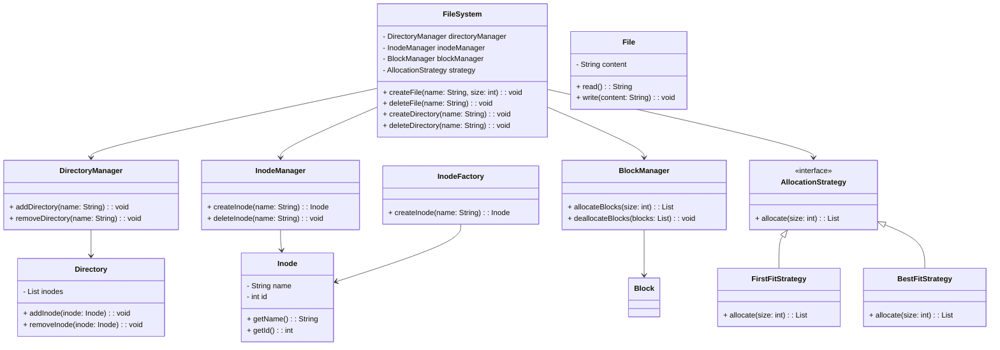

# FileSystem

## Project Overview

The `FileSystem` project is a simulation of a filesystem implemented in Java. It manages file and directory storage, allocation, and retrieval using a customizable allocation strategy. This project demonstrates core concepts of file management, memory allocation, and inode handling within a filesystem, supporting various allocation strategies such as First Fit and Best Fit.

## Key Features
1. **Inode Management**: Manages inodes, which represent files and directories, providing unique identifiers and metadata storage.
2. **Directory Management**: Supports the creation, deletion, and navigation of directories.
3. **File Management**: Allows users to create, read, write, and delete files.
4. **Allocation Strategies**: Provides multiple memory allocation strategies, allowing users to select an optimal strategy for their filesystem.

## Design Principles Used

1. **Single Responsibility Principle (SRP)**: Each class has a well-defined responsibility, like managing directories, files, or inodes, ensuring that functionality is not overloaded within a single class.
2. **Open-Closed Principle (OCP)**: The system is open to new allocation strategies without modifying existing code, achieved through a Strategy pattern for memory allocation.
3. **Dependency Inversion Principle (DIP)**: Higher-level components, like `FileSystem`, depend on abstractions (interfaces) for allocation strategies, which enhances flexibility and testability.

## Design Patterns

1. **Strategy Pattern**: Used for memory allocation strategies. The `AllocationStrategy` interface allows the system to dynamically choose between `BestFitStrategy` and `FirstFitStrategy`.
2. **Factory Pattern**: The `InodeFactory` creates instances of `Inode` objects, promoting modularity and simplifying the creation process.
3. **Singleton Pattern**: The `Logger` class employs the Singleton pattern to ensure a single logging instance throughout the application.

## Class Diagram

---

## Problem Statement (LLD)

### Requirements
Design a simplified filesystem to manage files and directories. The filesystem should support the following:
- **Inode Management**: Efficiently create, delete, and search for files and directories.
- **Memory Allocation**: Implement multiple allocation strategies (e.g., First Fit and Best Fit) to handle the storage of files in the filesystem.
- **File Operations**: Support creation, deletion, and modification of files.
- **Directory Operations**: Allow creating and deleting directories, and moving files between directories.
- **Logging**: Provide a logging mechanism to track operations on files and directories.

### Constraints
- The filesystem should manage memory allocation efficiently to avoid fragmentation.
- It should be modular, allowing easy addition of new allocation strategies.
- Operations should be logged, with only one instance of the logger active throughout.

### Non-Functional Requirements
- **Scalability**: The system should be capable of handling a large number of files and directories.
- **Extensibility**: The design should allow for adding new allocation strategies without modifying existing code.

---
